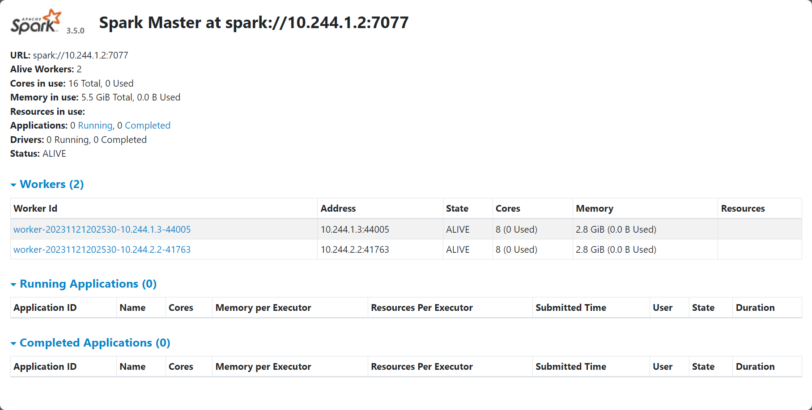
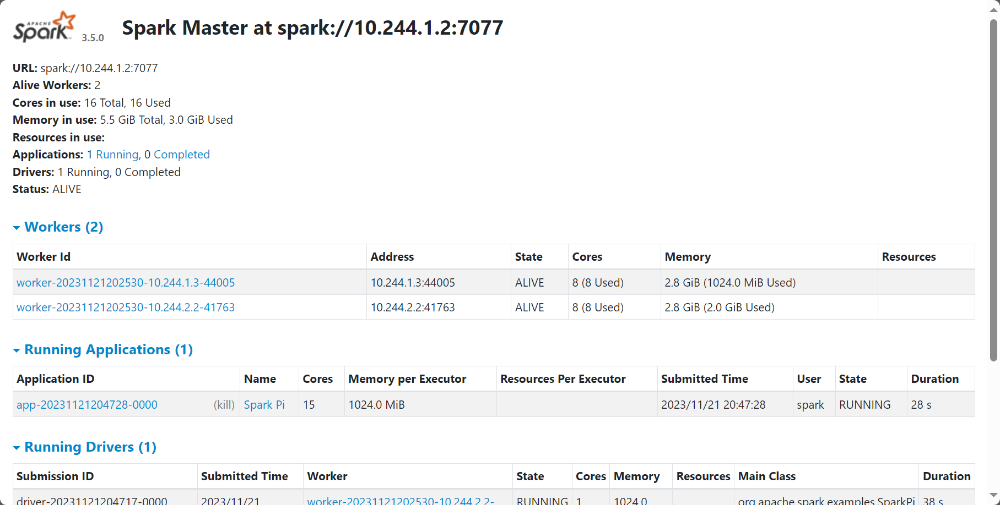

# Spark_cluster_with_k8s
## Установка kind
## Создание кластера в kind
```bash
cd kind 
kind create cluster --config kind-cluster.yaml
kind get clusters
# kind
```
## Создание namespace
```bash
kubectl create namespace spark
kubectl get namespace|grep spark
#spark                Active   23s
```
## Запуск service и deployment манифестов
```bash
cd ../k8s
kubectl apply -f spark-master-service.yaml -n spark
kubectl get service -n spark
# NAME                   TYPE        CLUSTER-IP    EXTERNAL-IP   PORT(S)    AGE
# spark-master-service   ClusterIP   10.96.88.63   <none>        7077/TCP   66s
kubectl apply -f spark-deployment.yaml -n spark
kubectl get deployment -n spark
# NAME           READY   UP-TO-DATE   AVAILABLE   AGE
# spark-master   1/1     1            1           113s
# spark-worker   2/2     2            2           113s
kubectl get pod -n spark
# NAME                            READY   STATUS    RESTARTS   AGE
# spark-master-659d596f87-bkxnc   1/1     Running   0          3m
# spark-worker-5994548665-wr6bs   1/1     Running   0          3m
# spark-worker-5994548665-xf6b2   1/1     Running   0          3m
```
## Проверим работу master-node
```bash
kubectl port-forward pod/spark-master-659d596f87-bkxnc -n spark 8080:8
080
```

## Запустим master-node
```bash
kubectl exec -it -n spark spark-master-659d596f87-bkxnc -- /bin/bash
```
В ней запустим выполнение задачи
```bash
/opt/spark/bin/spark-submit --master spark://10.244.1.2:7077 --deploy-mode cluster --class org.apache.spark.examples.SparkPi /opt/spark/examples/jars/spark-examples_2.12-3.5.0.jar 100000
```
Проверим запуск задачи
```bash
kubectl port-forward pod/spark-master-659d596f87-bkxnc -n spark 8080:8
080
```

